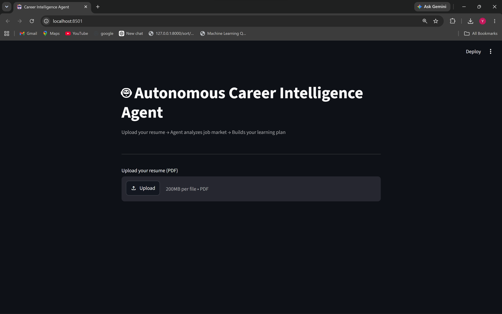
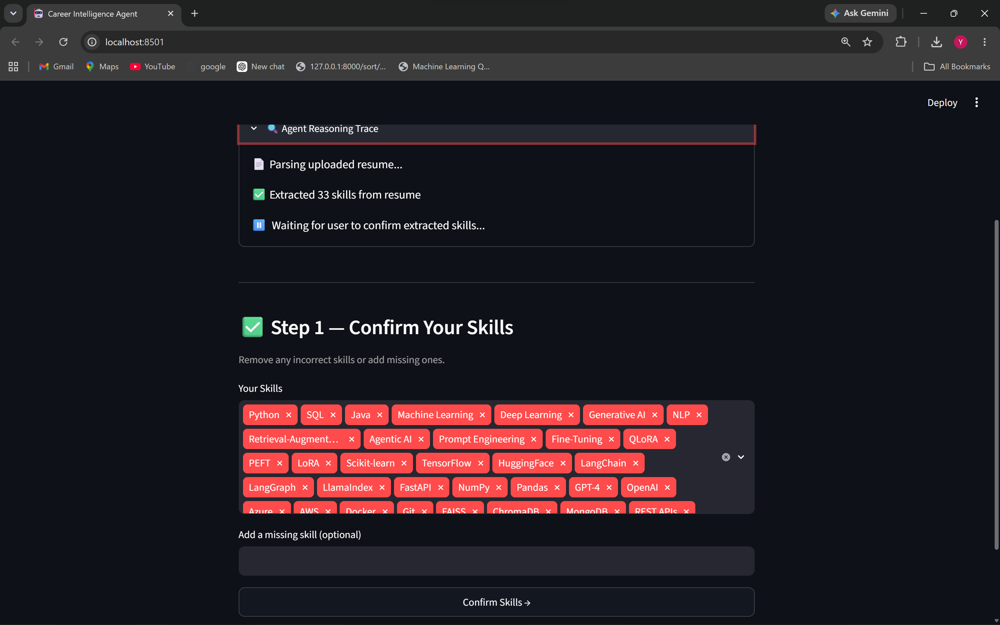
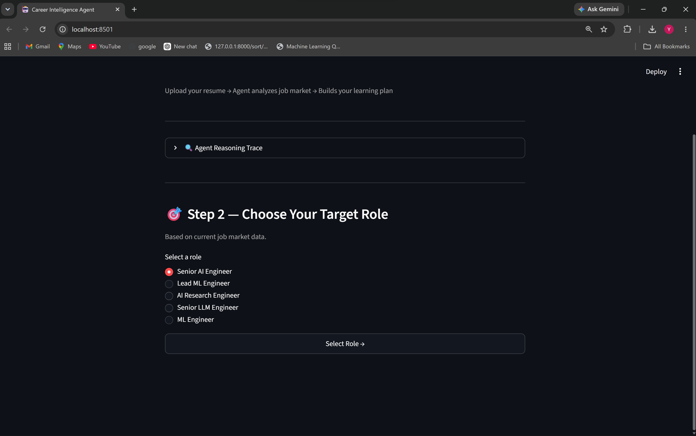
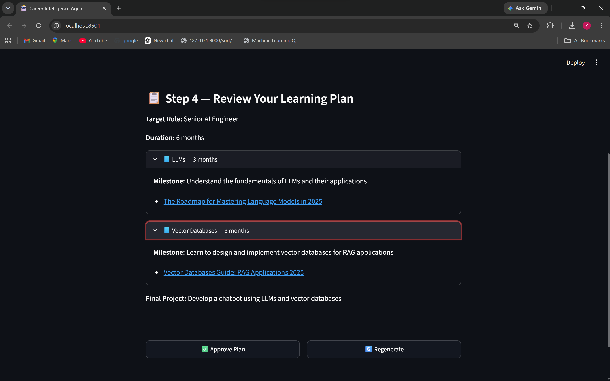

# Autonomous Career Intelligence Agent

A multi-tool LangGraph agent that analyzes your resume against the current job market, identifies skill gaps, and generates a personalized learning plan — with human-in-the-loop validation at every major decision point.

---

## Demo

### Upload Resume


### Skill Confirmation


### Target Role


### Learning Plan


---

## What I Learned / What Didn't Work

**HITL requires careful state design.** The concept is straightforward — pause, wait, resume. In practice, LangGraph's `interrupt()` and `Command(resume=...)` require every value in state to be serializable at each checkpoint. Passing raw PDF bytes through the graph state caused silent failures until I moved the conversion earlier in the pipeline.

**LLaMA 3.3 70B needs output guardrails for structured responses.** Inside a ReAct loop with active tool calls, the model occasionally wraps JSON in markdown fences or prepends commentary. Added cleanup and fallback defaults in the two nodes that depend on JSON output — `search_jobs_node` and `generate_plan_node`.

**Tool docstrings directly influence routing decisions.** The LLM selects tools entirely based on their description. A vague docstring on `analyze_skill_gaps` caused the agent to route to `search_job_postings` instead. Rewriting the description to be more specific resolved the routing without any logic changes.

**`MemorySaver` doesn't survive process restarts.** Sessions are lost when the API restarts. Acceptable for single-user local use, but `SqliteSaver` would be the right choice if persistence across restarts is needed.

---

## Tech Stack

| Layer | Technology |
|---|---|
| LLM | Groq / LLaMA 3.3 70B |
| Agent Framework | LangGraph |
| Web Search | Tavily |
| Database | SQLite + SQLAlchemy |
| PDF Parsing | PyMuPDF |
| Backend | FastAPI + Uvicorn |
| Frontend | Streamlit |
| Tracing | LangSmith |

Chose Groq over OpenAI mostly to save cost on the project. The speed is actually better too.

---

## Why LangGraph over LangChain

LangChain chains are stateless — each call is independent with no memory of previous steps. LangGraph introduces a proper state machine with built-in checkpointing, which is what makes multi-step human-in-the-loop workflows possible.

Without checkpointing, the entire pipeline would need to re-execute from the start each time a user responds. With `MemorySaver`, the graph persists state at every node and resumes from the exact point it was interrupted — making 4-step HITL flows practical without re-running expensive LLM calls.
---

## Project structure

```
autonomous-career-agent/
├── agent/
│   ├── state.py          # AgentState TypedDict
│   ├── tools.py          # 5 tools
│   └── graph.py          # Graph definition + HITL nodes
├── api/
│   └── main.py           # 3 FastAPI endpoints
├── ui/
│   └── app.py            # Streamlit UI
├── db/
│   ├── database.py       # SQLite setup
│   └── seed_data.py      # Sample job postings (AI/ML, India)
├── utils/
│   ├── resume_parser.py  # PDF parsing + skill extraction
│   └── evaluator.py      # Basic plan quality scoring
├── .env.example
└── requirements.txt
```

---

## Setup

```bash
git clone https://github.com/yashagarwal91/autonomous-career-agent
cd autonomous-career-agent

python -m venv career-agent-env
source career-agent-env/bin/activate

pip install -r requirements.txt
cp .env.example .env
```

Three API keys needed — all free tier:

```
GROQ_API_KEY=        # console.groq.com
TAVILY_API_KEY=      # app.tavily.com
LANGCHAIN_API_KEY=   # smith.langchain.com
```

```bash
python db/seed_data.py
```

---

## Running

```bash
# Terminal 1
python api/main.py

# Terminal 2
streamlit run ui/app.py
```
---

## Author
**Yash** — GenAI / LLM Engineer  
Exploring agentic AI patterns beyond RAG — stateful orchestration, tool calling, and human-in-the-loop workflows.